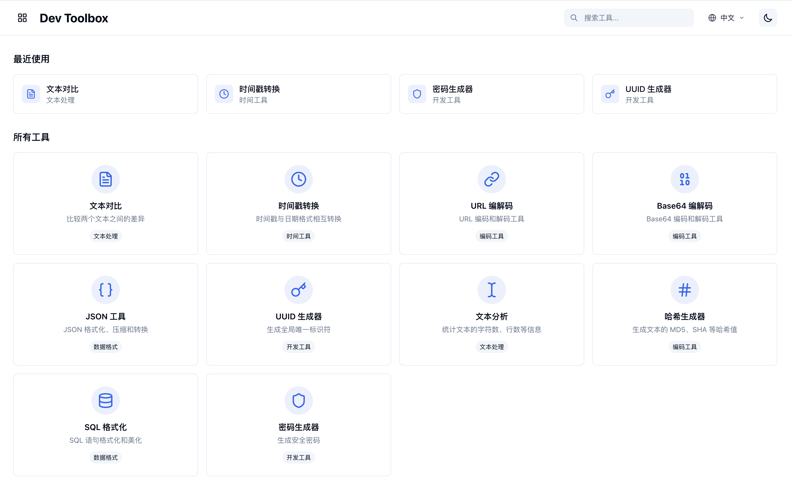
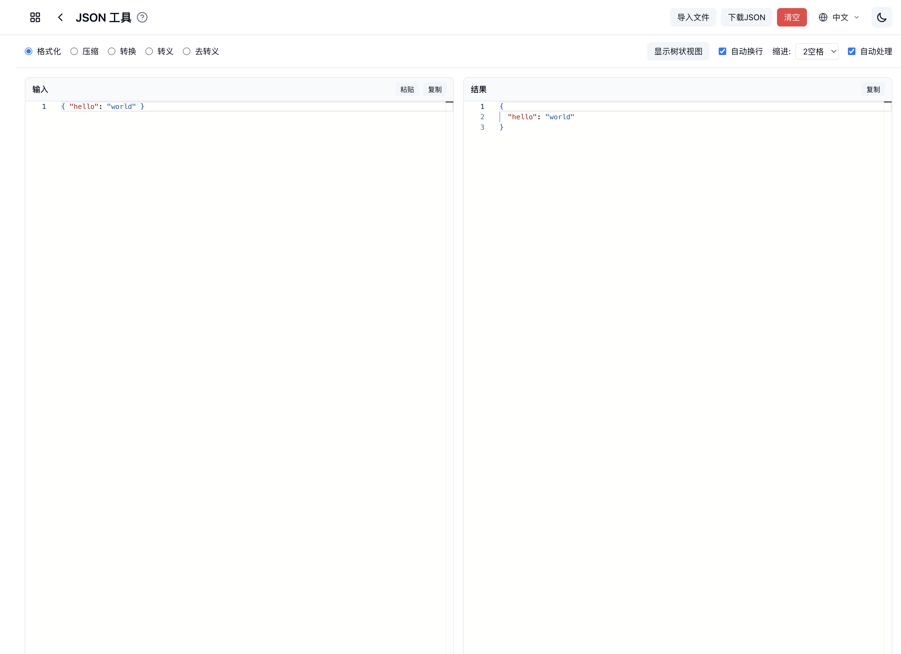

# Dev Toolbox

<div align="center">

**一个集成常用开发者工具的现代化 Web 应用**

[](https://opensource.org/licenses/MIT)
[](https://nodejs.org/)
[](https://vuejs.org/)
[](https://www.typescriptlang.org/)

[English](README.md) | 简体中文

</div>

## 🚀 功能特性

### 核心工具

- 📝 **文本对比工具** - 基于 Monaco Editor，支持分屏/内联对比，高亮差异，语法高亮，差异导航
- 🔤 **Base64 编解码** - 支持标准和URL安全模式，文件处理，实时转换
- 📄 **JSON 工具** - 格式化、压缩、验证，支持JSON↔YAML↔XML转换，JSONPath查询，树状视图
- 🔗 **URL 编解码** - 支持多种编码模式，实时处理
- ⏰ **智能时间戳转换** - 智能识别多种时间格式，输出标准格式
- 🔑 **UUID 生成器** - 生成标准UUID v4
- 📊 **文本分析** - 实时统计字符数、行数、段落数等
- 🔒 **哈希生成器** - 支持MD5、SHA系列算法
- 🗃️ **SQL 格式化** - 多数据库支持的SQL美化工具
- 🔐 **密码生成器** - 多种密码类型，安全强度分析

### 产品特色

✨ **现代化界面** - 基于 Monaco Editor，提供专业的代码编辑体验
🎨 **统一设计** - 一致的UI/UX设计，流畅的交互体验
🌙 **深色模式** - 自适应系统主题，护眼舒适
⚡ **高性能** - 实时处理，响应迅速
💾 **数据持久化** - 自动保存用户设置和历史记录
🌐 **基于浏览器** - 无需安装，任何浏览器均可访问

## 📸 预览




## 🛠️ 技术栈

- **前端框架**: Vue 3 + TypeScript
- **构建工具**: Vite 5
- **UI框架**: TailwindCSS 3
- **编辑器**: Monaco Editor (VS Code 核心)
- **状态管理**: Pinia
- **工具库**: dayjs、crypto-js、js-yaml、xml-js 等

## 🌐 在线访问

在浏览器中直接体验 Dev Toolbox：

**官方网站**: [https://dev-toolbox.vercel.app](https://dev-toolbox.vercel.app)

> 无需安装，支持所有现代浏览器

## 📦 本地开发

### 环境要求

- Node.js 18+
- npm 9+

### 克隆仓库

```bash
git clone https://github.com/your-username/dev-toolbox.git
cd dev-toolbox
```

### 安装依赖

```bash
npm install
```

### 开发模式

```bash
npm run dev
```

应用将在 `http://localhost:5173` 启动

### 生产构建

```bash
# 构建应用
npm run build

# 预览构建结果
npm run preview
```

## 🎯 使用指南

### 开始使用

1. 访问在线版本或本地运行
2. 在主界面选择需要使用的工具
3. 立即开始使用工具
4. 您的偏好设置会自动保存

### 快捷操作

- `Cmd/Ctrl + V`: 粘贴文本
- `Cmd/Ctrl + C`: 复制结果
- `Cmd/Ctrl + A`: 全选
- `Cmd/Ctrl + Z`: 撤销
- `Cmd/Ctrl + Shift + Z`: 重做

### 工具说明

每个工具页面都提供了详细的使用说明和示例，点击 "?" 图标查看帮助信息。

## 🤝 贡献指南

我们欢迎任何形式的贡献！请查看 [贡献指南](CONTRIBUTING.md) 了解详细信息。

### 快速开始贡献

1. Fork 本仓库
2. 创建功能分支 (`git checkout -b feature/AmazingFeature`)
3. 提交更改 (`git commit -m 'Add some AmazingFeature'`)
4. 推送到分支 (`git push origin feature/AmazingFeature`)
5. 创建 Pull Request

### 报告问题

如果您发现了 Bug 或有功能建议，请：

1. 查看 [已有 Issues](../../issues) 确认问题未被报告
2. 使用合适的 [Issue 模板](../../issues/new/choose) 创建新问题
3. 提供详细的重现步骤和环境信息

## 📝 更新日志

查看 [CHANGELOG.md](CHANGELOG.md) 了解版本更新详情。

### 最新版本亮点

- ✨ 全新的 Monaco Editor 集成
- 🎨 统一的 UI/UX 设计
- 🚀 性能优化和稳定性提升
- 🛠️ 新增多个实用工具

## 📄 许可证

本项目基于 [MIT License](LICENSE) 开源。

## 🙏 致谢

感谢以下开源项目的支持：

- [Vue.js](https://vuejs.org/) - 渐进式 JavaScript 框架
- [Monaco Editor](https://microsoft.github.io/monaco-editor/) - 强大的代码编辑器
- [TailwindCSS](https://tailwindcss.com/) - 实用优先的 CSS 框架
- [Vite](https://vitejs.dev/) - 快速的构建工具

## 📞 支持

如果您喜欢这个项目，请考虑：

- ⭐ 给项目点个星标
- 🐛 报告问题和建议
- 🔧 贡献代码
- 📢 推荐给其他开发者

---

<div align="center">

**让开发更高效，让工具更好用**

</div>